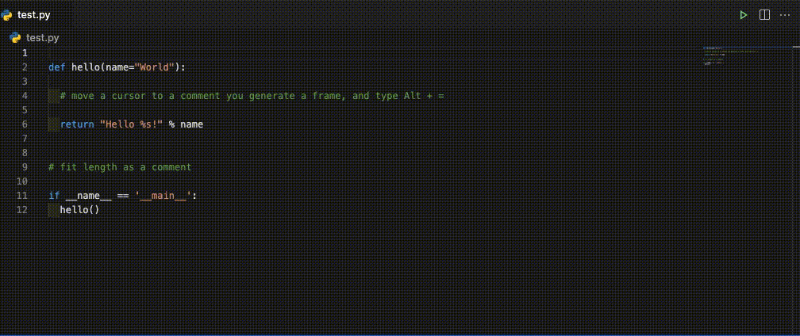

# Comment Frame Generator README
This is an extention for Python.
Generating a comment frame for decorating  an inline comment. Its frame's length follows the comment's length.

## Features
- Generate a frame which fit an inline comment length.

## Usage
Move cursor on a comment which you want to add a frame, and

- Shortcut key: `Alt + =`
- Right click menu: `Generate a comment frame`
- Command: `Generate a comment frame`

## Known Issues
None

When reporting issues, please register your issue on the github [issues](https://github.com/meow-noisy/comment-frame-generator/issues) page.

## Release Notes
### 0.0.1

Initial release.

## License
This project is licensed under the MIT License.